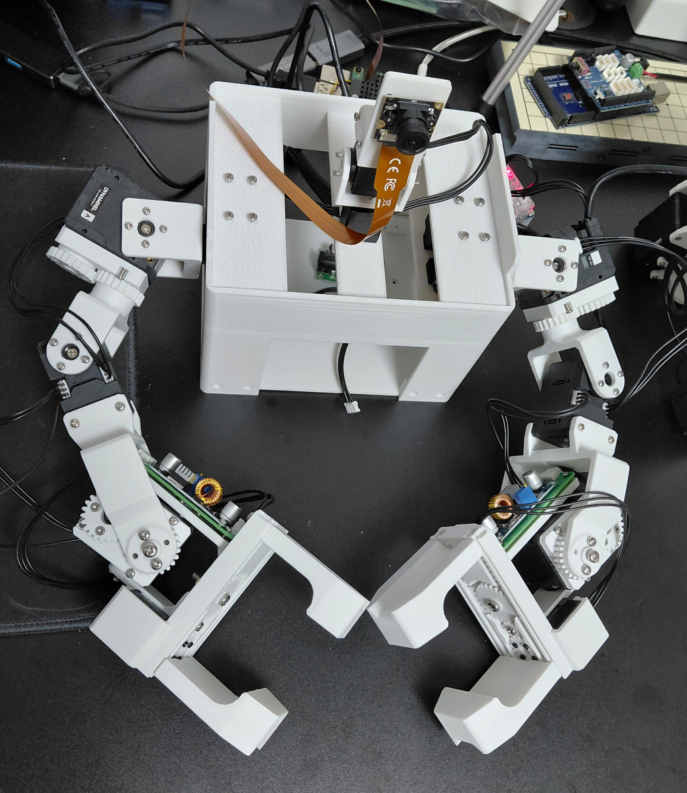
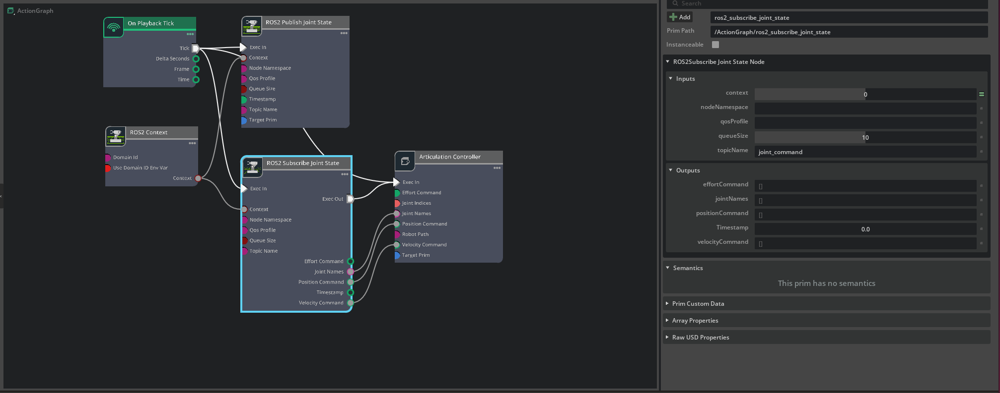
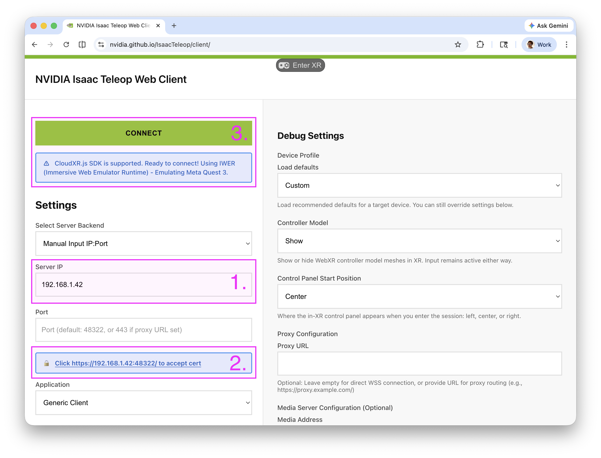
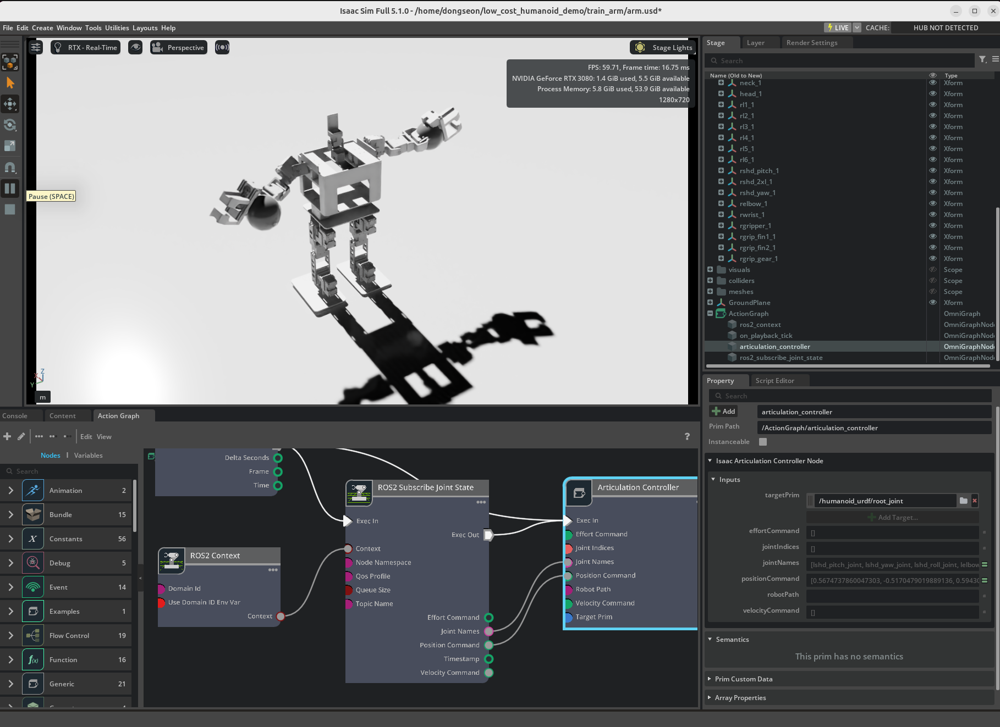

## 3d 프린팅 부품 설계

- 팔 설계 변경  
오리지날  

변경(덕컨버터 마운트 적용, 엘보 자유도 -1)  


- 모터 볼트 컨버터용 pcb 제작  
easyEDA 사용


## 3d 프린팅 조립
- 배선 정리  
  - 양팔 전압 변경
    - 2xl430(11.1v) > xl430(11.1v) > 2xl430(11.1v) > buck converter > xl330(5v) 
  - 양다리
    - xl430(11.1v) > xl430(11.1v) > xl430(11.1v) > xl430(11.1v) > xl430(11.1v) > xl430(11.1v)
  - 헤드 전압 변경
    - duck converter > xl330(5v) > xl330(5v) 
  - opencr ttl 소켓 3개 로봇양팔,다리,머리로 5개 케이블로 허브를 중간에 둬야함
  


## isaacsim sim2real 구현
- urdf 추출  


urdf 에서 기어비를 별도 나타내지 않고, low level 컨트롤 코드에서 반대방향으로 동작하도록 코딩  


그립퍼의 핑거 부분은 그리퍼 드라이븐 원 기어가 돌아가면 각 핑거의 톱니가 같이 움직이는 슬라이드 기어로 퓨전에서는 링크로 연결할 수 있으나 urdf에서는 다음과 같이 작성  

```xml
<joint name="lgripper_joint" type="revolute">
  <origin xyz="0.019 0.0397 0.0" rpy="0 0 0"/>
  <parent link="lgripper_1"/>
  <child link="lgrip_gear_1"/>
  <axis xyz="-0.0 1.0 0.0"/>
  <dynamics damping="10.0" friction="0.0"/>  <!-- 이 줄 추가 -->
  <limit upper="0.8727" lower="-5.2360" effort="100" velocity="100"/>
</joint>

<!-- 슬레이브 1: fin1 -->
<joint name="lgrip_fin1_slider" type="prismatic">
  <origin xyz="0.018907 0.0389 0.0192" rpy="0 0 0"/>
  <parent link="lgripper_1"/>
  <child link="lgrip_fin1_1"/>
  <axis xyz="1.0 0.0 0.0"/>
  <dynamics damping="10.0" friction="0.0"/>
  <limit upper="0.007" lower="-0.02" effort="100" velocity="100"/>
  <mimic joint="lgripper_joint" multiplier="0.00869" offset="0.0"/>
</joint>

<!-- 슬레이브 2: fin2 (반대 방향) -->
<joint name="lgrip_fin2_slider" type="prismatic">
  <origin xyz="0.019 0.0389 -0.0192" rpy="0 0 0"/>
  <parent link="lgripper_1"/>
  <child link="lgrip_fin2_1"/>
  <axis xyz="1.0 0.0 0.0"/>
  <dynamics damping="10.0" friction="0.0"/>
  <limit upper="0.02" lower="-0.007" effort="100" velocity="100"/>
  <mimic joint="lgrip_fin1_slider" multiplier="-1.0" offset="0.0"/>
</joint>
```

isaacsim import하여 damping, stifness 등 점검  
카메라 세팅 등 하여 usd 파일로 저장


moveit
```bash
wsl -d Ubuntu-20.04
sudo apt update
sudo apt install -y ros-noetic-moveit ros-noetic-moveit-visual-tools
sudo apt install python3-empy

source /opt/ros/noetic/setup.bash
cd /mnt/d/making/dynamixel/rasberrypi/catkin_ws
# catkin_make # conda deactivate

source devel/setup.bash
# MoveIt 로드

OGRE_RTT_MODE=Copy \
LIBGL_ALWAYS_SOFTWARE=1 \
GALLIUM_DRIVER=llvmpipe \
QT_X11_NO_MITSHM=1 \
roslaunch moveit_setup_assistant setup_assistant.launch
```
  
무브잇으로 엔드이펙터를 움직여 플랜 생성  

curobo or cumotion  

## 오큘러스 teleoperation  
- isaac teleop  
  - vr헤드셋에 별도 설치 없이 web 브라우저로 서버 접속하여 데이터 전송  
  - 현시점 ubuntu 환경에서만 가능  
  - 아직 윈도우 미지원으로 멀티부팅 우분투 24.04 설치 후 진행  

- isaacsim/lab 가상환경 생성 후 isaacsim 실행(vr을 위한 xr로 진행)
```
source env_isaaclab/bin/activate
source /home/dongseon/.cloudxr/run/cloudxr.env
export ROS_DISTRO=jazzy
export RMW_IMPLEMENTATION=rmw_fastrtps_cpp
export ROS_DOMAIN_ID=0
export ROS_LOCALHOST_ONLY=1

export LD_LIBRARY_PATH=$LD_LIBRARY_PATH:/home/dongseon/env_isaaclab/lib/python3.11/site-packages/isaacsim/exts/isaacsim.ros2.bridge/jazzy/lib

isaacsim \
  /home/dongseon/env_isaaclab/lib/python3.11/site-packages/isaacsim/apps/isaacsim.exp.base.xr.vr.kit --enable isaacsim.ros2.bridge --enable omni.graph.window.action --enable omni.graph.ui --enable omni.kit.window.script_editor
```
- isaacsim 실행 후 arm.usd파일을 열어 플레이 실행  
액션그래프



isaacteleop 가상환경 생성
```
cd ~/IsaacTeleop
source .venv/bin/activate

source /opt/ros/jazzy/setup.bash

export ROS_DISTRO=jazzy
export RMW_IMPLEMENTATION=rmw_fastrtps_cpp
export ROS_DOMAIN_ID=0
export ROS_LOCALHOST_ONLY=1


python examples/teleop_ros2/python/teleop_ros2_node.py \
  --ros-args \
  -p mode:=controller_teleop \
  -p rate_hz:=30.0 \
  -p world_frame:=world \
  -p accept_eula:=true
```
기존 isaacteleop ros 스크립트를 실행한 뒤 메뉴얼과 같이 vr헤드셋 브라우저에서 웹서버를 접속 후 connect  
[메뉴얼참고](https://nvidia.github.io/IsaacTeleop/main/getting_started/quick_start.html)  



isaacsim과 teleop서버를 실행 후 토픽리스트를 확인  
```
source /opt/ros/jazzy/setup.bash

export ROS_DISTRO=jazzy
export RMW_IMPLEMENTATION=rmw_fastrtps_cpp
export ROS_DOMAIN_ID=0
export ROS_LOCALHOST_ONLY=1

ros2 node list
ros2 topic list
```


isaacsim 스트립트 에디터에서 스크립트를 실행 후 컨트롤러를 움직이면 로봇의 엔드이펙터가 따라움직이는 걸 확인  




- lerobot dataset 변환

## 합성 데이터 셋 생성
- isaacsim augmentation + 3d gaussian splatting  
- cosmos transfer + inverse dynamics model 활용  

## vla manipulation 학습
- lerobot 학습

