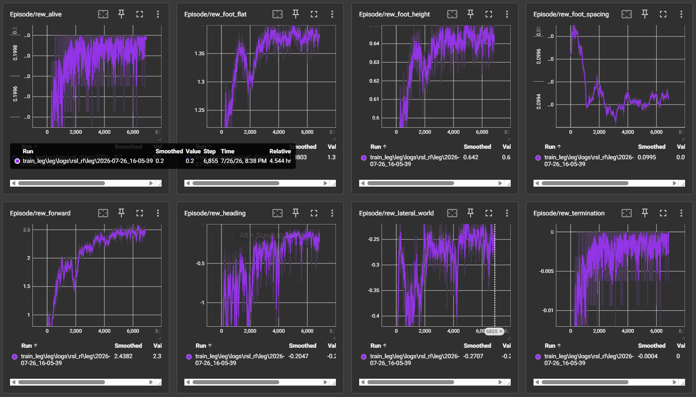
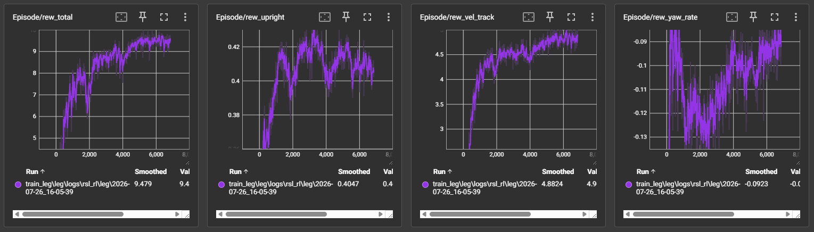

## 3d 프린팅 부품 설계

- 3d 프로그램
  - onshape : sas 서비스이고, isaacsim에서 바로 onshape로봇을 불러올 수 있음
  - fusion : autodesk cad나 maya 등이 익숙하다면 사용, claude 모델을 mcp로 연결해도 됨, 개인용도는 무료
- op3의 stl 파일이 있으나 본래 부분은 금속소재로 플라스틱 출력 시의 강도가 예상되지 않아, 새로 적당한 두께로 설계
- 모터 stl를 불러와서 사용하고 다른 부분의 스케치가 없어서 대략적으로 스케치하여 모델링 

[다이나믹셀 step파일](https://www.robotis.com/service/downloadpage.php?ca_id=70)  
나사, 각종 보드는 구글에서 모델링 파일 검색하면 쉽게 구할 수 있음


## 3d 조립 완성 및 단순구조 변환


- 하단 git 레포 참고하여 fusion 애드인 설치 진행
- 단순 구조로 변환
    - 모든 부위를 하나의 본체로만 구성
    - 모터 조인트 설정 시 부모 자식의 순서를 잘 맞춤, 조인트 한계각도 설정
	- 모터의 회전 조인트 및 구성요소 이름 설정  
	- fusion2urdf repo에 유의사항을 체크하여 아래와 같이 변환해야 urdf 변환 오류가 발생안됨


https://github.com/dheena2k2/fusion2urdf-ros2
https://github.com/runtimerobotics/fusion360-urdf-ros2

## urdf 변환 및 usd 파일 생성

- urdf 추출 후 기본 세팅 진행  
추출경로 urdf폴더에 4개의 파일이 생성됨
*.gazebo *.trans *.xacro materials.xacro
xacro파일은 isaacsim에서 불어올 수 없어 urdf 변환이 필요함

- xacro > urdf 변환
  - ros2로 변환 가능
  - *.xacro의 확장자를 urdf로 바꾸고 내부에서 import하는 부분을 지운 뒤 .trans와 materials.xacro 파일 내부 내용을 urdf에 복사해도 됨
- 각종 오류 체크
  - inertia mass가 0이거나 damping 값이 없으면 isaacsim에서 오류 발생할 수 있어서 urdf에서 수정하거나 로드 후 값 입력
  - 각 joint drive의 stiffness는 isaacsim에서 입력


- isaacsim & isaaclab 설치  
  - 환경 구성  
    - window 11 / rtx 3080 8G / 566.36 nvidia driver / cuda toolkit 12.8
    - anaconda 환경 python 3.11

        isaaclab 2.3.0  
        isaacsim 5.1.0  
        torch 2.7.0+cu128  
        torchvision 0.22.0+cu128  

- isaacsim 실행하여 urdf 파일 import하여
  - inertial collision friction damping stiffness 등 설정하여 usd 저장  
  - legs를 default prim 설정  
  - collider 등 기본 설정이 잘못되면 학습도 안됨  
  - root joint는 제거, 고정 암일 경우나 필요  


## isaaclab 걷기 학습

환경 생성
```bash
./isaaclab.sh --new
Task type : Externel
Project path : d:/making/dynamixel/leg
Project name : leg
Direct | single-agent
rsl_rel, skrl
AMP, PPO
```

- 기본으로 생성하면 다음과 같이 생성됨
- cart pole로 되어 있어 커스텀 코드로 수정


- usd 파일  
leg\source\leg\leg\tasks\direct\leg\legs_cfg.py
```d
stiffness={".*": 5000.0}, # 너무 낮으면 몸의 무게감이 없음, 500이상 추천 
damping={".*": 10.0}, # 
velocity_limit_sim={".*": 10.0},
```

- 기본 환경 설정  
leg\source\leg\leg\tasks\direct\leg\leg_env_cfg.py

- 액션 스페이스 및 보상 등 중요한 환경 요소 수정  
leg\source\leg\leg\tasks\direct\leg\leg_env.py

**기본보상**  
해당 보상만으로 진행 시 한다리로 지탱하며 앞으로 콩콩 뛰어감  
```d
rew_alive # 안넘어지고 살아있으면 보상
rew_termination # 넘어지면 패널티
rew_upright # 바디의 높이가 유지되면 보상
rew_forward # 월드 x방향(로봇의 초기 앞쪽)으로 진행 시 보상, 너무 높으면 걷지 못하고 넘어짐
rew_vel_track # 원하는 속도에 도달하면 보상
rew_heading # 몸의 방향과 월드 x방향이 동일할 경우 보상, 없다면 진행 시 시계방향으로 돌아감
```
**추가보상1**  
걷기 모션을 위해 추가, 월드 x방향 직선 보행이 아닌 y방향이 포함된 대각선 보행이 발생
```d
rew_foot_spacing # 다리 간격, 없어도 무관할 듯
rew_foot_height # 발 높이, 발 교대 보상
rew_foot_flat # 발 평면 유지, 지면이 평평하다는 조건 하
```
**추가보상2**  
```d
rew_yaw_rate # 몸이 돌아가는 걸 방지, 게걸음으로 진행하는 걸 방지
rew_lateral_world # y방향 패널티, 게걸음으로 진행하는 걸 방지
```

- 모델 관련  
leg\source\leg\leg\tasks\direct\leg\agents\rsl_rl_ppo_cfg.py  

학습 초기 보상만을 얻기위한 요령을 터득하는 걸 방지하기 위해 탐색을 좀 더 하도록 수정
```d
    policy = RslRlPpoActorCriticCfg(
        init_noise_std=2.0, # 초기탐색
        actor_obs_normalization=False,
        critic_obs_normalization=False,
        actor_hidden_dims=[32, 32],
        critic_hidden_dims=[32, 32],
        activation="elu",
    )
    algorithm = RslRlPpoAlgorithmCfg(
        value_loss_coef=0.5, #
        use_clipped_value_loss=True,
        clip_param=0.2,
        entropy_coef=0.001, # 탐색 더하게
        num_learning_epochs=5,
        num_mini_batches=4,
        learning_rate=2.5e-4, #
        schedule="adaptive",
        gamma=0.99,
        lam=0.95,
        desired_kl=0.01,
        max_grad_norm=1.0,
    )
```

- 그 외 확인할 것  
leg\scripts\rsl_rl\train.py


- 학습 실행  
3080 pc 약 1시간 소요
```bash
# 환경 변수 추가
export BASE_PATH="복사한경로"

python scripts/rsl_rl/train.py --task=Template-Leg-Direct-v0 --num_envs=200 --max_iterations=5000
```


모든 그래프가 우상향으로 그려지는지 모니터링




```d
################################################################################
                     Learning iteration 6006/10000

                       Computation: 782 steps/s (collection: 1.874s, learning 0.171s)
             Mean action noise std: 1.59
          Mean value_function loss: 235.4259
               Mean surrogate loss: -0.0118
                 Mean entropy loss: 22.2170
                       Mean reward: 2657.49
               Mean episode length: 274.92
            Mean episode rew_alive: 0.2000
      Mean episode rew_termination: 0.0000
          Mean episode rew_upright: 0.4077
          Mean episode rew_forward: 2.5196
        Mean episode rew_vel_track: 4.9062
          Mean episode rew_heading: -0.1460
         Mean episode rew_yaw_rate: -0.0861
    Mean episode rew_lateral_world: -0.2155
     Mean episode rew_foot_spacing: 0.0995
      Mean episode rew_foot_height: 0.6573
        Mean episode rew_foot_flat: 1.4078
            Mean episode rew_total: 9.7506
--------------------------------------------------------------------------------
                   Total timesteps: 9611200
                    Iteration time: 2.04s
                      Time elapsed: 03:58:10
                               ETA: 02:38:21
```

- 추론
```bash
$env:BASE_PATH="{$project_path}/train_leg"
cd {$project_path}/train_leg/leg
python scripts/rsl_rl/play.py --task Template-Leg-Direct-v0 --num_envs 20 --checkpoint ./model_4999.pt
```


https://github.com/user-attachments/assets/a8d00207-1886-4957-bb30-7761e3211d93


## 3d 프린팅 조립
- 각 stl 파일 프린팅 > 구조 강도 개선과 조립 위해 특정 부품은 새롭게 모델링 진행  
프린팅 시 나사 구멍 등이 수축됨, 히트 인서트를 모든 나사 구멍에 삽입하는 것은 매우 힘든 일이므로 테스트 출력으로 나사 구멍 사이즈 조정 필요
- 각 부품 무게 측정 > 실제 무게로 usd 파일 설정


## 아두이노 opencr 모터컨트롤

**다이나밀셀 위저드로도 기본 설정 가능  
- 아두이노 ide에 opencr 설치 후 usb 연결하면 보드확인 및 라이브러리 사용 가능함  
- 처음 연결하면 공장 초기화 모터아이디는 모두 1번임, 모터 체인에 따라 차례대로 번호 세팅을 해야함  
  
여기에서는 왼발 위쪽 부터 차례대로 1~6번  
오른발 위쪽 부터 차례대로 7~12번 세팅  

```arduino
check_motor_id.io 보드를 usb 연결 후 코드 실행 하면 시리얼 모니터로 모터 아이디 번호 확인 가능
edit_motor_id.io 실행 하면 모터 아이디를 수정 가능
check_motor_position.io 현 모터의 포지션 수치를 시리얼 모니터로 확인
```

**중요
urdf에 저장된 조인트 라디안 min max값을 적용하면 실제 모터 방향과 다르게 움직여 다음과 같이 적용함 (fusion에서 접합 구동으로 로봇을 조정 후 urdf 파일로 변환한 이유일 것으로 추측)  

```arduino
const float URDF_MIN_RAD[12] = {
  -1.57,   -1.57,   -1.57,    0.0,   -0.43, -1.04, // 왼발 (1번: -1.57)
  0.0,     -0.43,   -0.43,   -1.39,  -1.57, -1.57  // 오른발 (7번: 0.0)
};

const float URDF_MAX_RAD[12] = {
  0.0,    0.43,     0.43,     1.39,   1.57,  1.57,  // 왼발 (1번: 0.0)
  1.57,   1.57,     1.57,     0.0,    0.43,  1.04   // 오른발 (7번: 1.57)
};
```

다음값을 각 모터에 입력하면 라디안 변환하여 움직여짐(180도에 해당하는 모터 값은 2048임, 1000은 약 90도)  
```arduino
1: -1000 ~ 0
2: -1000 ~ +200
3: +1000 ~ -200
4: -1000 ~ 0
5: -1000 ~ +200
6: -1000 ~ +300

7: 0 ~ +1000
8: -200 ~ +1000
9: -1000 ~ +200
10: 0 ~ +1000
11: -200 ~ +1000
12: -300 ~ +1000
```


```arduino
motor_control.io opencr 구동 시 위치를 초기값으로 설정하게끔 되어 있음, 라즈베리파이에서 값을 python 스크립트나 ros로 통신하기 위한 코드, usb 연결하여 실행 후 업로드 완료하면 라즈베리파이에 usb연결하여 사용
```


## rasberrypi opencr 연결
- opencr과 rasberrypi는 usb로 연결
- rasberrypi 환경설정
  - 데비안 설치
  - venv Python 3.13.5
  - ros noetic container
    - ros:noetic-ros-base-focal  
- 라즈베리파이 파이썬 스크립트 컨트롤  
venv에서 rpi_joint_teleop.py 실행 후 원하는 모터와 라디안(90도 = 1024) 입력


- ros 컨트롤 (rbiz에서 슬라이더로 모터를 컨트롤)
라즈베리파이는 ros noetic 컨테이너 실행

```bash
# 초기 세팅 외부 호스트
# 1. 모든 로컬 사용자의 디스플레이 접근 제한을 완전히 해제 (보안 비활성화) 
xhost + 
# 2. Xauthority 인증 파일 권한을 모두가 읽을 수 있도록 개방 
chmod 644 ~/.Xauthority

# 초기 세팅 컨테이너 내부
apt update
apt install -y ros-noetic-joint-state-publisher-gui ros-noetic-robot-state-publisher ros-noetic-rviz
apt install -y python-is-python3
apt install -y python3-pip 
pip3 install pyserial


# 컨테이너 외부 호스트
# 1. 디스플레이 :0 환경변수를 임시 지정하여 xhost 무력화
DISPLAY=:0 xhost +local:docker

# 2. 만약 위 명령어가 실패하면 디바이스 전체 개방으로 재시도
DISPLAY=:0 xhost +

# 컨테이너 내부
source /opt/ros/noetic/setup.bash

cd /workspace/catkin_ws 
# catkin_make 
source devel/setup.bash # 런치 파일 실행 

# 1. 완벽한 소프트웨어 렌더링 강제 (Mesa softpipe 지정) 
export LIBGL_ALWAYS_SOFTWARE=1 
export GALLIUM_DRIVER=softpipe 
# 2. X11 공유 메모리 버퍼 완전히 비활성화 (Segmentation Fault 차단 핵심) 
export QT_X11_NO_MITSHM=1 
export MITSHM=0 
# 3. 만약 하이딩된 세션 에러 방지를 위해 디스플레이 다시 선언 
export DISPLAY=:0
roslaunch opencr_rcm_control display_and_control.launch
```


## isaacsim sim2real 구현

conda에 isaacsim은 ros2라서 ros1과 통신할 브릿지 역할의 웹소켓을 같이 띄움  
isaacsim에서 조인트 damping stiffness 설정 필요

```
[호스트 isaac_bin conda]
  Isaac Sim 5.0
  → ROS2 /joint_states 퍼블리시
  → roslibpy 클라이언트
        ↕ WebSocket (LAN)
[라즈베리파이 Docker: ros_noetic]
  rosbridge_server (WebSocket :9090)
  → roscore
  → 로봇 (/dev/ttyACM0)
```

ros1 rasberrypi 컨테이너
```bash
apt update 
apt install -y ros-noetic-rosbridge-suite 
source /opt/ros/noetic/setup.bash 
roslaunch rosbridge_server rosbridge_websocket.launch
```

conda
```bash
pip install roslibpy


isaacsim --enable isaacsim.ros2.bridge --enable isaacsim.ros2.sim_control --enable omni.isaac.ros2_bridge
```

leg_w.usd 파일 로드
플레이 후 scripts editor 실행
```bash
#!/usr/bin/env python3
import rospy
from sensor_msgs.msg import JointState
import serial
import math

RAD_TO_DXL_STEP = 2048.0 / math.pi

class ROSSerialBridgeFast:
    def __init__(self):
        rospy.init_node('ros_serial_bridge', anonymous=False)
        
        # 1. 초고속 통신을 위해 1Mbps로 보레이트 상향 (OpenCR 소스도 맞춰야 함)
        self.port = "/dev/ttyACM0"
        self.baud = 115200  
        
        try:
            # write_timeout을 추가하여 시리얼 전송 지연이 메인 루프를 막는 현상 방지
            self.py_serial = serial.Serial(port=self.port, baudrate=self.baud, timeout=0.001, write_timeout=0.001)
            rospy.loginfo("➔ [FAST] Connected to OpenCR at 1Mbps!")
        except Exception as e:
            rospy.logerr(f"➔ Failed to connect OpenCR: {e}")
            return

        self.last_sent_steps = [0] * 12

        self.joint_id_map = {
            "lbase_joint": 1, "ll1_joint": 2, "ll2_joint": 3, "ll3_joint": 4, "ll4_joint": 5, "ll5_joint": 6,
            "rbase_joint": 7, "rl1_joint": 8, "rl2_joint": 9, "rl3_joint": 10, "rl4_joint": 11, "rl5_joint": 12
        }

        # 2. tcp_nodelay=True를 추가하여 ROS 네트워크 패킷 지연(Nagle 알고리즘)을 원천 차단
        rospy.Subscriber("/joint_states", JointState, self.joint_state_callback, queue_size=1, tcp_nodelay=True)
        rospy.loginfo("➔ [FAST] ROS-Isaac Serial Bridge Running...")

    def joint_state_callback(self, msg):
        cmd_tokens = []
        any_changed = False

        for i, name in enumerate(msg.name):
            if name in self.joint_id_map:
                joint_id = self.joint_id_map[name]
                radian = msg.position[i]
                
                if joint_id == 1:
                    radian = -radian
                
                step_offset = int(radian * RAD_TO_DXL_STEP)

                # 3. 필터 컷오프를 5스텝(약 0.4도)으로 상향하여 무의미한 고주파 트래픽 차단
                if abs(step_offset - self.last_sent_steps[joint_id - 1]) > 10:
                    cmd_tokens.append(f"{joint_id},{step_offset}")
                    self.last_sent_steps[joint_id - 1] = step_offset
                    any_changed = True

        if any_changed and cmd_tokens:
            serial_cmd = "/".join(cmd_tokens) + "\n"
            try:
                self.py_serial.write(serial_cmd.encode())
                # 속도 최적화를 위해 실시간 주크박스 로그(rospy.loginfo)는 주석 처리합니다.
                # 터미널에 프린트를 찍는 행위 자체가 파이썬 연산 속도를 엄청나게 갉아먹습니다.
            except serial.SerialTimeoutException:
                pass # 시리얼 버퍼 밀림 발생 시 과감히 패킷 드랍하여 실시간성 유지

    def shutdown_hook(self):
        if hasattr(self, 'py_serial') and self.py_serial.is_open:
            self.py_serial.close()

if __name__ == '__main__':
    bridge = ROSSerialBridgeFast()
    rospy.on_shutdown(bridge.shutdown_hook)
    rospy.spin()
```

라즈베리파이에서 로스 실행 후 rostopic echo /joint_states 로 조인트 확인 가능

브릿지 실행

```bash
cd /workspace/catkin_ws 
source devel/setup.bash 
chmod +x src/opencr_rcm_control/scripts/ros_serial_bridge.py # 파이썬 중계 노드 단독 기동! 

rosrun opencr_rcm_control ros_serial_bridge.py
```

## locomotion 구현

zmp  
지면과 발바닥 사이에 마찰력이 없어서 발바닥에 미끄럼 방지 고무 부착 필요  
venv에서 zmp_walk.py 실행  
https://github.com/user-attachments/assets/5ca6f1dd-a935-40f1-bca3-d703732ec3d1

[참고](https://ieeexplore.ieee.org/document/4209488)

강화학습모델 realworld 적용  
학습 config파일의 엑추에이터 순서와 실제 low level 컨트롤하는 모터 순서 매칭 필요  
```
    actuators={
        "legs_dxl": ImplicitActuatorCfg(
            joint_names_expr=[
                "lbase_joint",
                "rbase_joint",
                "ll1_joint",
                "rl1_joint",
                "ll2_joint",
                "rl2_joint",
                "ll3_joint",
                "rl3_joint",
                "ll4_joint",
                "rl4_joint",
                "ll5_joint",
                "rl5_joint",
            ],
            stiffness={".*": 5000.0}, # 500.0
            damping={".*": 10.0},
            velocity_limit_sim={".*": 10.0},
        ),
    }
```


navigation  
라이다 없이 nav2 가능한지 확인?
